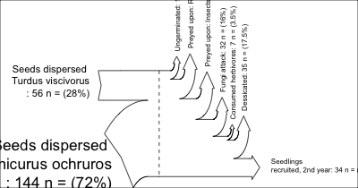
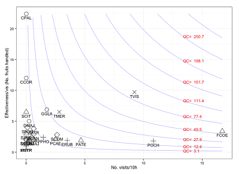
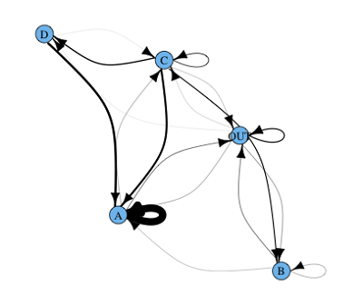
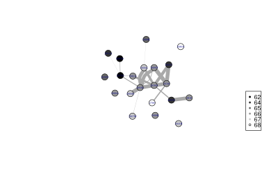

-   FIGURE THEMES
    -   General stats
        -   Sankey diagram for demographic transitions
    -   Multipanel plots
        -   ggplot slopegraph multipanel
    -   Multivariate
    -   Time series
    -   Spatial / Maps
        -   Topographic map
        -   Ploting dispersal kernels
    -   Networks
        -   Plotting effectiveness landscapes
        -   Assignements network
        -   Gene Flow
    -   Licence

This repository intends to be a catalog of figures made in [our group](http://ebd10.ebd.csic.es/ebd10/Home.html) with the associated R code used to produce them. Scroll down to browse the available figures. Clicking on any of them will take you to the source code used to produce it.

**CONTRIBUTING**

See [here](https://github.com/PJordano-Lab/R-figures/blob/master/contributing.md) for information on how to contribute new figures and code.

FIGURE THEMES
=============

General stats
-------------

#### Sankey diagram for demographic transitions

Multipanel plots
----------------

#### ggplot slopegraph multipanel

Multivariate
------------

Time series
-----------

Spatial / Maps
--------------

#### Topographic map

#### Ploting dispersal kernels

Networks
--------

#### Plotting effectiveness landscapes

More information on effectiveness landscapes is in [Pedro Jordano Lab Pages @GitHub](<http://pedroj.github.io>).

#### Assignements network

#### Gene Flow

Licence
-------

Creative Commons License

This work and all other materials under <https://github.com/PJordano-Lab/> are licensed under a [Creative Commons Attribution 4.0 International License](https://creativecommons.org/licenses/by/4.0/legalcode).
