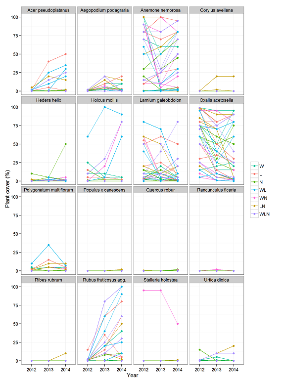

-   General stats
-   Multipanel plots
    -   ggplot slopegraph multipanel
-   Time series
-   Spatial / Maps
    -   Topographic map
-   Networks

This repository intends to be a catalog of figures with the associated R code we used to produce them. Scroll down to browse the available figures. Clicking on any of them will take you to the source code used to produce it.

General stats
-------------

Multipanel plots
----------------

#### ggplot slopegraph multipanel

Time series
-----------

Spatial / Maps
--------------

#### Topographic map

Networks
--------

Licence:
