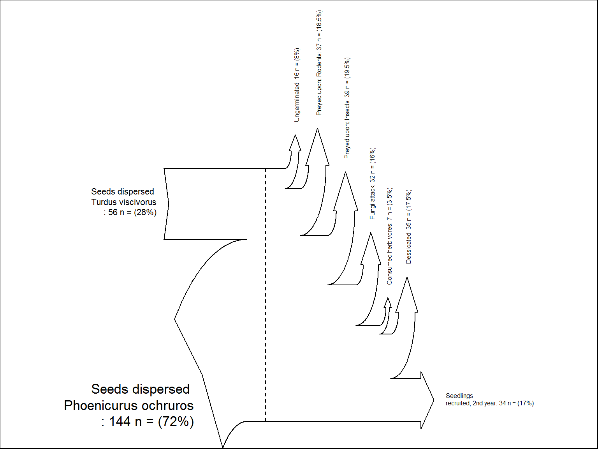

-   [A repository of R graphics with their associated code](#a-repository-of-r-graphics-with-their-associated-code)
-   [FIGURE THEMES](#figure-themes)
    -   [General stats](#general-stats)
        -   [Sankey diagram for demographic transitions](#sankey-diagram-for-demographic-transitions)
        -   [Survival curves (ggplot)](#survival-curves-ggplot)
    -   [Multipanel plots](#multipanel-plots)
        -   [ggplot slopegraph multipanel](#ggplot-slopegraph-multipanel)
    -   [Multivariate](#multivariate)
    -   [Time series](#time-series)
    -   [Spatial / Maps](#spatial-maps)
        -   [Topographic map](#topographic-map)
        -   [Plotting dispersal kernels](#plotting-dispersal-kernels)
        -   [Plotting expected vs empirical distances](#plotting-expected-vs-empirical-distances)
    -   [Networks](#networks)
        -   [Plotting effectiveness landscapes](#plotting-effectiveness-landscapes)
        -   [Assignments network](#assignments-network)
        -   [Gene flow](#gene-flow)
    -   [Licence](#licence)

A repository of R graphics with their associated code
=====================================================

This repository intends to be a catalog of figures made in [our group](http://ebd10.ebd.csic.es/ebd10/Home.html) with the associated R code used to produce them. Scroll down to browse the available figures. Clicking on any of them will take you to the source code used to produce it.

**CONTRIBUTING**

See [here](https://github.com/PJordano-Lab/R-figures/blob/master/contributing.md) for information on how to contribute new figures and code.

**OTHER REPOS WITH R CODE TO PRODUCE FIGURES**

-   [R graph catalog](http://shiny.stat.ubc.ca/r-graph-catalog/)

-   [The R graph gallery](http://www.r-graph-gallery.com/)

-   [R graph gallery](http://rgraphgallery.blogspot.com/)

-   [Cookbook for R: Graphs](http://www.cookbook-r.com/Graphs/)

-   [A compendium of clean graphs in R](http://shinyapps.org/apps/RGraphCompendium/index.php)

-   [Graphical data analysis with R](http://www.gradaanwr.net/)

FIGURE THEMES
=============

General stats
-------------

#### Sankey diagram for demographic transitions

#### Survival curves (ggplot)

Multipanel plots
----------------

#### ggplot slopegraph multipanel

Multivariate
------------

Time series
-----------

Spatial / Maps
--------------

#### Topographic map

#### Plotting dispersal kernels

#### Plotting expected vs empirical distances

Networks
--------

#### Plotting effectiveness landscapes

More information on effectiveness landscapes is in \[Pedro Jordano Lab Pages @GitHub\](<http://pedroj.github.io>).

#### Assignments network

#### Gene flow

Licence
-------

Creative Commons License

This work and all other materials under <https://github.com/PJordano-Lab/> are licensed under a [Creative Commons Attribution 4.0 International License](https://creativecommons.org/licenses/by/4.0/legalcode).
